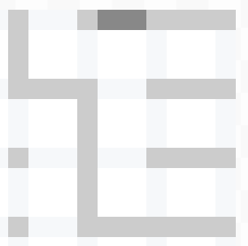
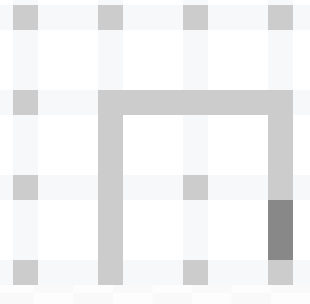

# pencil

点格棋以及其AI

在线游戏: [link](http://zhaouv.net/pencil/)

## AI

### GreedyRandomAI

+ 当有能立刻得分的边时直接落子拿分
+ 无法立刻得分也无需让分时, 随机一个不让分的边走
+ 必须让分时, 挑面积最小的连通区域让给对手

### OffensiveKeeperAI

继承GreedyRandomAI, 但是不计算代价的在收盘阶段尝试保持先手, 在能立刻得分时引入额外的判断, 满足任意一个就选择拿分, 均不满足时选择让分数抢先手:

+ _场上存在落字双方也无法得分的边_
+ 最后一个连通区域 
+ _存在面积1的区域_
+ _面积2的区域多于一个_
+ _面积2的区域为1个但和目前能那分的区域不是同一个_
+ 多个不同的连通区域能得分(_并未选择先吃掉不含边界的区域_)
+ 拿分区域含边界且长度不为2
+ 拿分区域不含边界且长度不为4

_斜体部分_ 是不够完善的分析, 利用其中的漏洞可以100%胜率战胜这个AI.

### 进一步提升的思路

此处不列举最大最小值搜索alpha-beta剪枝等通用型搜索

**定义**

如果一个连通区域内有两个点间有两个无重叠的通路, 两个路构成`环`

如果一个连通区域无法立刻得分, 且其内再下任意一笔, 对方就能得分, 称之为`闭区域`

面积为1或2的闭区域称为`小区域`, 面积大于等于3的称为`大区域`

大区域根据是否包含环可以分为`有环区域`和`无环区域`

无法改变分割, 不让分且不得分的步称为`无关步`

(图中的最后一笔是无关步)

游戏明显分为2个阶段, 定义为`布局`和`收官`

**策略**

通过让分抢先手的策略, 收官阶段先抢到第一个大区域的玩家基本能够获胜, 除非局面非常细碎且有很多有环区域.

于是转化为布局阶段抢到最后一个能改变先后手的结构

于是转化为布局阶段结束进入收官阶段的一瞬间, 保持能改变先手后的结构是偶数个(或者是0个且剩余无关步数+小区域个数是偶数)

能改变先后手的结构:  [一个区域有多种分割, 并且不同的分割, 无环区域的数量有不同]  

  
  
  

## 网络对战

目前状态是能够运行

## Python API

提供了Python的接入支持 [doc](pythonapi.md)

# Notice

`socket.io/socket.io.js` from [socket.io-client](https://github.com/socketio/socket.io-client/blob/master/dist/socket.io.js) ([LICENSE](socket.io/LICENSE))

`server.js` modified from [motajs/socket_server](https://github.com/motajs/socket_server/blob/master/server.js)